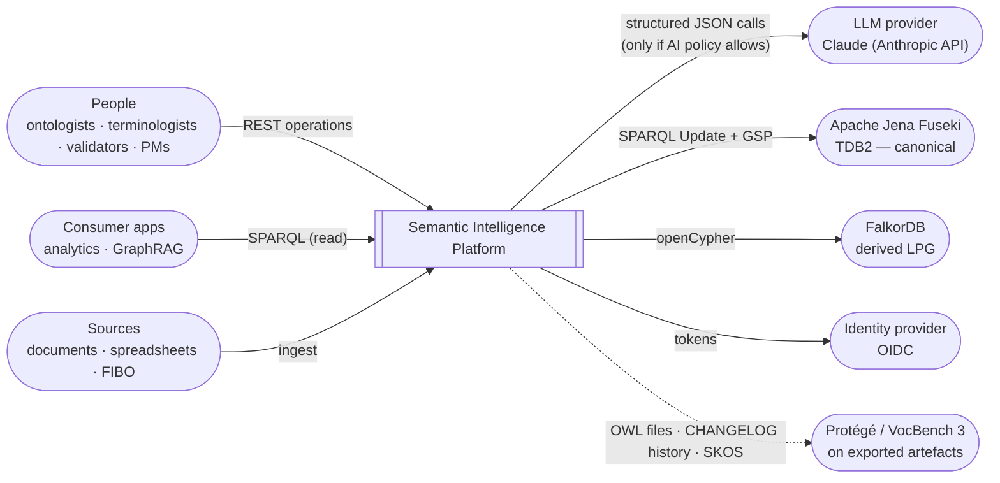
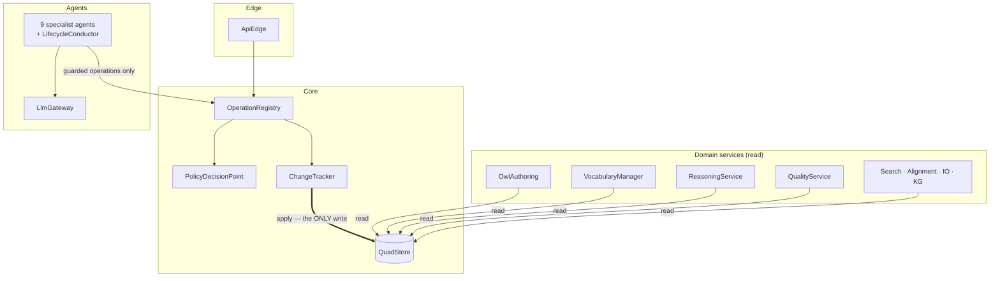
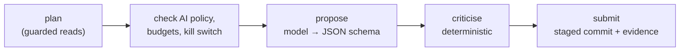
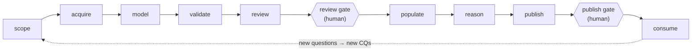
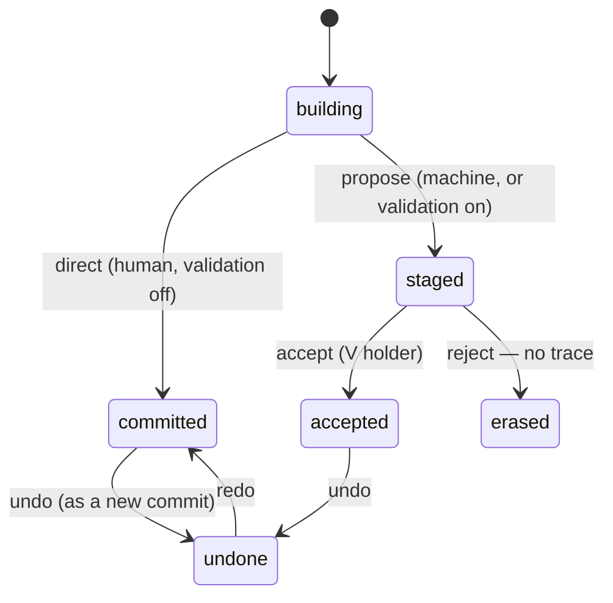
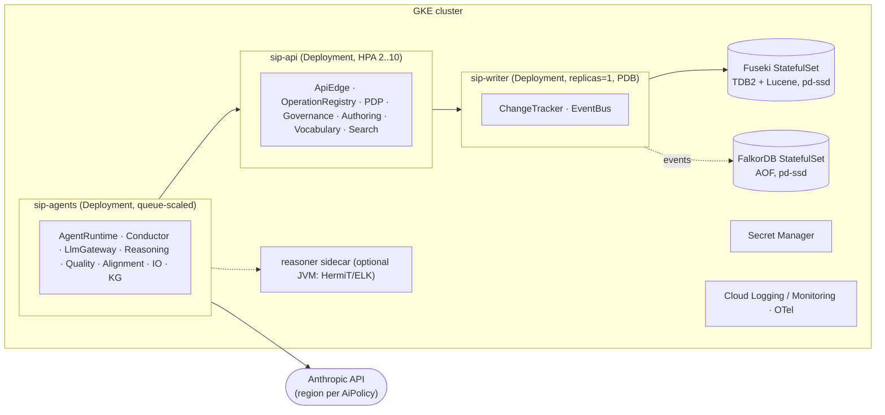

# Semantic Intelligence Platform — Architecture Description

**Method:** Rozanski & Woods, *Software Systems Architecture* (2nd ed.). The description
is organised as stakeholders and concerns, then scenarios, then seven views (one per
viewpoint), then perspectives applied across the views.
**Models:** SysML v2 textual notation in [`models/`](models/). The R&W frame is itself
expressed in SysML v2: stakeholders are `part def`s, concerns are `concern def`s, the
viewpoints are `viewpoint def`s, and every view is a `view def` that satisfies one.
Perspectives are `@Perspective` metadata on the requirements and `@Tactic` metadata on
the design decisions that answer them.
**Checked by:** [`tools/sysml_check.py`](tools/sysml_check.py). It checks that every
reference resolves, that every requirement is satisfied *and* verified, that every
viewpoint has a view, and that every test a verification case names exists. It also
checks the two structural guarantees of §6.
**Implementation:** [`src/Semantic Intelligence Platform/semantic_intelligence`](../../src/Semantic%20Intelligence%20Platform/semantic_intelligence).
It is about 10.5 kLOC of Python with 74 tests, including executable architecture rules
and a FIBO corpus regression.
**Status:** 2026-10-05. Version 0.1: the core is implemented and verified; the items in
§14 are open.

| Read this for… | Section |
|---|---|
| What the system is and why it exists | §1, §3 |
| Who cares about what | §2 |
| How it behaves end to end | §4, §6.3 |
| The seven views | §5–§11 |
| Security, performance, resilience, evolution, AI trustworthiness, … | §12 |
| Decisions and what is still open | §13, §14 |
| Where Protégé and VocBench code went | [`REVERSE_ENGINEERING.md`](REVERSE_ENGINEERING.md) |
| Requirement-by-requirement trace | [`generated/TRACEABILITY.md`](generated/TRACEABILITY.md) |

---

## 1. Purpose and scope

The **Semantic Intelligence Platform (SIP)** carries a knowledge asset end to end, from
the first brief to a published, queried knowledge graph:

```
scope → acquire → model → validate → review ║ populate → reason → publish ║ consume
```

An agent assists every stage. A human decides at the two gates (`║`).

It is built by **translating the two reference tools into Python**:

* **Protégé Desktop:** OWL 2 authoring at the axiom level, Manchester syntax with
  completion, hierarchies, description frames, refactoring, reasoning, explanations.
* **VocBench 3 / Semantic Turkey:** projects, roles and CRUDV capabilities, complete
  change tracking, staged validation, SKOS/SKOS-XL management, the resource view,
  integrity checks, search, alignment, and the import/export pipeline.

It then adds what neither has:
* an end-to-end lifecycle with gates;
* competency questions as executable tests;
* an **agent layer that is safe by construction**. Agents are ordinary governed
  principals: every agent write is a staged proposal with evidence, and only a human
  can accept it.

**Relationship to earlier designs in this repository.** The
[Ontology Builder design set](../ontology_builder/) (2026-08-31) extracted 138 features
from the same three tools and planned a Python backend with a JVM sidecar. SIP is the
end-to-end umbrella that the Builder becomes one part of (the *model/validate/review*
stages). It implements the Builder's governance foundation, and it **revises two of its
decisions**:
* Manchester parsing and justifications are done in Python, not delegated to a JVM
  (ADR-03, ADR-04).
* The Semantic Turkey server source was read directly (REVERSE_ENGINEERING §1).

It reuses `src/Ontology Modeler` (the Fuseki client and diff), the
[read-only assistant design](../ontology_assistant/), and the grounded-extraction
approach of `langextract_ontology`.

**Out of scope for v0.1:**
* the React workbench (the API and its operation discovery are its contract);
* OntoLex-Lemon editing, custom forms (PEARL), the metadata-registry connectors, and
  issue-tracker integration.

These are listed in §14.

---

## 2. Stakeholders and concerns

`models/sip_viewpoints.sysml`: 12 stakeholder part defs and 15 concern defs. Each
stakeholder appears in at least one concern, and every concern is framed by at least
one viewpoint (checked).

| Stakeholder | R&W class | Principal concerns |
|---|---|---|
| Ontology Engineer | user | AuthoringExpressiveness, LogicalCorrectness, Interoperability, ScaleAndLatency |
| Knowledge-Graph Engineer | user | EndToEndLifecycle (acquire → populate), DataQuality |
| Terminologist | user | VocabularyManagement (multilingual SKOS, language-restricted editing) |
| Domain Expert | user | AgentUsefulness (does the platform shorten *their* time?) |
| Validator | user | ControlledPublication, AgentSafety, DataQuality |
| Project Manager | user, acquirer | ControlledPublication, CompleteHistory, AccessControl |
| Knowledge Consumer | user | LogicalCorrectness, DataQuality, Interoperability |
| Platform Operator | system administrator, production engineer | Operability, ScaleAndLatency |
| Platform Developer | developer, maintainer | Extensibility, Maintainability |
| Security Officer | assessor | AccessControl, CompleteHistory |
| AI Governance Board | assessor | AgentSafety: bounded autonomy, grounding, auditability |
| Sponsor | acquirer | EndToEndLifecycle, AgentUsefulness |

**Viewpoint → concern framing** (generated, [`generated/diagrams/viewpoints.mmd`](generated/diagrams/viewpoints.mmd)):

| Viewpoint | Frames |
|---|---|
| Context | EndToEndLifecycle, Interoperability |
| Functional | AuthoringExpressiveness, VocabularyManagement, EndToEndLifecycle, Extensibility, AccessControl, AgentUsefulness |
| Information | CompleteHistory, ControlledPublication, DataQuality, LogicalCorrectness, AccessControl |
| Concurrency | ScaleAndLatency, CompleteHistory |
| Development | Maintainability, Extensibility |
| Deployment | ScaleAndLatency, Operability |
| Operational | Operability, AgentSafety |

---

## 3. Architectural principles

Each principle comes from something learned by reading the sources.

| # | Principle | Origin | Consequence |
|---|---|---|---|
| P1 | **One write path.** Nothing writes to the store except `ChangeTracker`, through the store's single `apply` method. | ST's SAIL interception has no Fuseki equivalent, so it is rebuilt as an invariant. | History is complete *by construction*. `test_single_write_path` enforces it |
| P2 | **The workflow is the graph layout.** A proposal is a triple in a staging graph, never a flag on content. | ST validation | Stable content needs no status filter. Reject leaves no trace |
| P3 | **Everything is RDF**: content, history, competency questions, mappings, evidence. | ST "everything's RDF" | One backup, one query language, one access model |
| P4 | **The operation registry is the product.** Every capability is a typed, guarded operation; UI, CLI, notebooks and agents all call `Platform.call`. | VocBench mirrored 995 operations in 61 hand-written client classes | Discovery (`GET /operations`) replaces hand mirroring. Authorization lives in one place |
| P5 | **Agents are principals, not a subsystem with its own rules.** | VocBench machine accounts | No second trust model. The PDP, staging and history apply unchanged |
| P6 | **The model proposes; deterministic stages decide.** | Protégé's checker-driven editors; the explanation workbench | Every proposal passes a critic: verbatim quote, Manchester parse, reasoner, mapping validation, SPARQL parse |
| P7 | **Profile honesty.** Every entailment and explanation states the reasoner and OWL profile that produced it. | Protégé shows which reasoner is active; RL ≠ DL | No RL result is presented as a DL result |
| P8 | **Python core, optional JVM.** | Measured: the Python Manchester and axiom layers round-trip 99.6% of FIBO | No JVM in the critical path. HermiT registers only if Java is present |

---

## 4. Key scenarios

Scenarios are what the views are evaluated against. S1 runs as the demo
(`python -m semantic_intelligence.demo`) and as `test_end_to_end_demo`.

| # | Scenario | Exercises |
|---|---|---|
| **S1** | *Brief + documents + a table → released graph.* A PM enables agents. RequirementsAgent writes 3 CQs with SPARQL tests. ExtractionAgent proposes 14 grounded candidates (classes, taxonomy, properties), each with a verbatim quote and offsets. ModelingCopilot proposes `'has wheel' some wheel` etc., quoting the sentence it rests on. Each proposal passes the reasoner critic. VocabularyAgent fills French labels. StewardAgent summarises 26 pending commits and the validator accepts them. KG builder lifts the CSV: 4 manufacturers, one bad integer rejected with a warning, `owl:sameAs` proposed for *Volvo Cars* ≈ *Volvo Car Corporation*. Classification runs. **The release gate fails on `cq_Manufacturer_Country`**, which no source supports, and Q&A answers cite rows. | Every stage, both gates, CQs, critics, staging, evidence, metrics |
| S2 | *Thesaurus team, French only.* A lexicographer bound with `languages=[fr]` edits a French prefLabel (allowed) and an English one (denied by the PDP). Setting a new prefLabel demotes the old one to altLabel. | PDP language rule, SKOS label rules |
| S3 | *Align the org ontology to FIBO.* AlignmentAgent runs lexical matching. Cells ≥ 0.95 are auto-accepted; the model adjudicates borderline ones. Accepted cells become `skos:exactMatch` / `owl:equivalentClass` in the **mappings** graph, which needs `rdf(resource, alignment)`. | Alignment, project-scoped graphs |
| S4 | *A modeller adds `Triffid ⊑ Plant` while `Animal ⊓ Plant ⊑ ⊥` holds.* The copilot's critic refuses that very proposal ("would make unsatisfiable: Triffid"). Made by a human, it lands. QualityAgent then explains it (one justification, 4 axioms) and proposes removing the class's own assertion. | Reasoner critic, explanation, repair |
| S5 | *An agent goes wrong* (bad prompt, model drift). Every write it made is staged and attributed. The operator stops the run, rejects its commits by `evidence.run`, and disables the agent in the AI policy. **Nothing to roll back.** | Kill switch, staging, operational viewpoint |
| S6 | *LLM provider outage.* Agents degrade (`status=degraded`, no proposals). All 66 operations remain usable by humans. | QR-AVL-02 |
| S7 | *Restore after corruption.* The Fuseki backup is restored. History and content come back together because they are one dataset written in one transaction per commit. | QR-AVL-01, P1, P3 |
| S8 | *Migrate a VocBench project.* Content and history graphs are imported unchanged (the CHANGELOG terms are identical) and roles map 1:1 (the same nine roles). | QR-EVO-02 |

---

## 5. Context view

*Viewpoint:* `ContextViewpoint`. *Model:* `models/sip_context.sysml`: the system of
interest, 8 external entity defs, 7 boundary port defs, the context part with its
connections, and 12 use cases (one of them the E2E use case that includes the other ten).



Decisions visible in this view:
* **There is no back door into Fuseki.** Editors and agents reach the store only through
  the platform, so P1 holds for every client, not just the bundled ones.
* **One port carries data to the LLM provider**, and it is gated by the per-project
  `AiPolicy` (QR-SEC-03). A project with `llm_allowed=False` never sends a byte, and its
  agents degrade.
* **Legacy tools remain first-class consumers.** OWL export opens in Protégé, and the
  history is VocBench-readable (QR-EVO-02).

---

## 6. Functional view

*Viewpoint:* `FunctionalViewpoint`. *Model:* `models/sip_functional.sysml`: 18
functional element defs, an abstract `SpecialistAgent` with 9 specialisations, 7 port
defs, 6 interface defs, the `SipSystem` white box with 30 connections, and 52 `satisfy`
relations.

### 6.1 Elements

| Element | Responsibility | Python | Reverse-engineered from |
|---|---|---|---|
| ApiEdge | REST, discovery, agent endpoints | `api/app.py` | — |
| **OperationRegistry** | 66 typed operations; `call()` authorises, executes, commits | `platform.py` | ST `@STServiceOperation` + `@PreAuthorize` |
| **PolicyDecisionPoint** | CRUDV algebra + `isAuthorized` order of checks | `governance/capabilities.py`, `registry.py` | `STAuthorizationEvaluator`, `roles/*.pl`, `AuthorizationEvaluator.ts` |
| GovernanceRegistry | principals, projects, ACL, bindings, groups, settings, URI generators, AI policy | `governance/` | `ProjectManager`, `STPropertiesManager`, `NativeTemplateBasedURIGenerator` |
| **ChangeTracker** | the one write path; commits, staging, accept/reject, undo/redo | `core/changes.py` | `ChangeTrackerConnection`, `HistoryManagerImpl` |
| QuadStore | in-memory Dataset / Fuseki; single `apply` | `core/store.py` | — (reuses `ontology_modeler` FusekiClient by duck typing) |
| OwlAuthoring | axiom view, Manchester, rendering, hierarchies, frames, refactoring | `owl/` | OWL API, `ManchesterOWLSyntaxParser`, `AssertedClassHierarchyProvider`, `OWLClassDescriptionFrame`, `OWLEntityRenamer` |
| VocabularyManager | SKOS + SKOS-XL | `skos/` | `SVC/SKOS.java`, `SVC/SKOSXL.java` |
| ReasoningService | backends, derived status, inferred hierarchy, justifications | `reasoning/` | `OWLReasonerManagerImpl`, owlexplanation |
| QualityService | ICV, metrics, CQ tests, release gate | `quality/` | `SVC/ICV.java`, `MetricsPanel` |
| Search / Alignment / IoPipeline / KgConstruction | as named | `search/`, `alignment/`, `io/`, `kg/` | ST Search, Alignment, InputOutput/Export, Sheet2RDF |
| LlmGateway | Claude or deterministic simulators, one JSON-schema contract | `agents/llm.py`, `simulators.py` | — |
| AgentRuntime, LifecycleConductor, 9 SpecialistAgents | runs, budgets, kill switch, metrics; stage plan; per-stage assistance | `agents/` | — |

### 6.2 Structure and the two structural guarantees



The full generated version is [`generated/diagrams/functional.mmd`](generated/diagrams/functional.mmd).
Both guarantees are **checked on the model and on the code**:

1. **Only the tracker writes.** In `SipSystem` the single connection to `store.write`
   comes from `tracker.write` (`sysml_check`). In the code, `store.apply(` appears only
   in `core/changes.py` (`test_single_write_path`).
2. **Agents reach the platform only through guarded operations.** Agent parts connect
   to `registry` and `gateway` and nothing else (`sysml_check`). The agents package
   never imports `core.changes` or `core.store` (`test_layering`).

### 6.3 Primary interactions

**Guarded call** (`SipBehaviour::CallOperation`):
1. resolve the principal;
2. resolve `%resource_role%` against the staged view;
3. the PDP decides;
4. the operation runs (read, or build a `ChangeSet`);
5. the tracker commits, or stages if the principal is a machine or validation is on.

Agent evidence travels as a call argument and lands on the commit.

**Agent loop** (`SipBehaviour::AgentLoop`), the same for every agent:



| Agent | Stage | Model task (schema) | Critic | Writes |
|---|---|---|---|---|
| RequirementsAgent | scope | `requirements.cqs` | SPARQL parses; expectation well-formed; quote verbatim from the brief | CQs (cq graph) |
| ExtractionAgent | acquire | `extraction.candidates` | quote verbatim in the source (offsets recorded); names known; xsd ranges | classes, taxonomy, properties |
| ModelingCopilot | model | `modeling.axioms` | Manchester parses; **classify before/after: no new inconsistency or unsatisfiable class**; quote verbatim | axioms |
| VocabularyAgent | model | `vocabulary.labels` | language is missing *and* a project language; trimmed | labels |
| AlignmentAgent | model | `alignment.adjudicate` (borderline cells only) | relation × role table (ST); nothing accepted → no proposal | mappings graph |
| QualityAgent | validate | `quality.repair` | the axiom proposed for removal belongs to a justification | ICV fixes (per-fix capability), repairs |
| StewardAgent | review | `steward.summaries` | risk and recommendation are **computed**, not generated | nothing |
| KnowledgeGraphBuilder | populate | `kg.mapping` | `TableMapping.validate` against the ontology; lexical validation of values | individuals, `owl:sameAs` |
| AssistantAgent | consume | `assistant.sparql` | the answer is filled from query rows only (cited) | nothing |

### 6.4 The E2E process



`lifecycle.setStage` refuses a machine principal that tries to close `review` or
`publish`. The conductor's `resume` refuses to continue while the review gate is open.

---

## 7. Information view

*Viewpoint:* `InformationViewpoint`. *Model:* `models/sip_information.sysml`: graph
roles, writability classes, 10 item defs, and 3 lifecycle state machines.

### 7.1 Storage: named-graph layout

Per project `p`, the graph IRI is `urn:sip:p:{p}:{role}`. The single source of truth is
`core/layout.py`.

| Graph | Holds | Written by | Class |
|---|---|---|---|
| `main` | stable ontology (TBox + vocabulary) | `commit` (human, validation off) or `accept` | content |
| `kg` | stable instance data (ABox) | same | content |
| `{main\|kg}:staging-add` / `:staging-del` | proposals | `commit` (staged) | workflow |
| `imports:{sha1}` | materialised imports | `replace_derived` | derived |
| `inferred` | closure minus asserted | `replace_derived` after classification | derived |
| `mappings` | accepted alignment cells | `alignment.apply` (commit) | content |
| `cq` | competency questions + SPARQL tests | `quality.addCompetencyQuestion` (commit) | content |
| `history` | `cl:Commit` records | in the **same `apply`** as content | system |
| `shapes`, `metadata`, `evidence` | reserved (SHACL, DCAT/VoID, long evidence) | — | — |

The TBox (`main`) and the ABox (`kg`) are separate content graphs. A KG population run
cannot touch an axiom, and a reasoner can be pointed at either.

### 7.2 Change model

* **A `ChangeSet` is Protégé's change list at triple level.** Its *effective* delta is
  recorded as a `cl:Commit` with `cl:addedStatement` / `cl:removedStatement`
  `cl:Quadruple`s, plus `prov:startedAtTime`, `prov:wasAssociatedWith`,
  `cl:parentCommit`, `cl:revisionNumber` and `cl:status`. The vocabulary is Semantic
  Turkey's, unchanged.
* **SIP adds** `sip:operation`, `sip:parameters`, `sip:validatedBy`, `sip:reverts` and
  `sip:evidence`. Evidence is stored as JSON: agent, run, model, prompt hash,
  confidence, rationale, on-behalf-of, `ai_generated`, and the quote with offsets.



Accept checks for **conflicts**. If a staged removal's triple has meanwhile disappeared,
the accept is refused (`ConflictError`); it is never silently merged.

### 7.3 Ownership, quality, retention

| Information | Owner | Quality mechanism | Retention |
|---|---|---|---|
| Content graphs | project (PM) | PDP + validation + ICV + release gate | versioned by history |
| History | platform | append-only; undo is a commit | ≥ audit period (QR-REG-01) |
| Evidence | platform, on behalf of the agent's principal | attached to the commit; quotes verified verbatim | with the commit |
| Governance (principals, bindings, roles, AI policy) | platform admin + PM | PDP; RDF export planned (§14) | configuration backup |
| Derived graphs | platform | recomputable; never edited | none needed |

---

## 8. Concurrency view

*Viewpoint:* `ConcurrencyViewpoint`. *Model:* `models/sip_deployment.sysml` (concurrency
part).

| Process group | Replicas | State | Coordinates through |
|---|---|---|---|
| API workers | 2–10 (HPA) | stateless | write coordinator queue, store reads |
| **Write coordinator** | **exactly 1 per dataset** (`SingleWriterPerDataset`) | owns the tracker lock | one SPARQL Update per commit = one TDB2 transaction |
| Agent workers | queue-scaled | run state | operations (as callers); bounded per project and per model quota |
| Reasoner workers | CPU-scaled | none | classify in memory → `replace_derived` (one short transaction) |
| Projection sync | 1 | cursor | `CHANGES_COMMITTED`/`ACCEPTED` events → FalkorDB |

* **TDB2 is single-writer.** The platform designs for that limit instead of discovering
  it. In code, `ChangeTracker` serialises under a re-entrant lock and `InMemoryStore`
  under a writer lock. Every commit is a single `Store.apply`, and `FusekiStore.apply`
  sends one request: `DELETE DATA` / `DELETE…WHERE` for blank-node removals, then
  `INSERT DATA`. So content and history can never diverge.
* **Long work never holds the writer.** Reasoning, justification search, alignment and
  lifting compute off-path and submit one change set.
* **Agents never hold a request thread.** Model calls are slow and billed, so they run
  in the agent pool.

---

## 9. Development view

*Viewpoint:* `DevelopmentViewpoint`. *Model:* `models/sip_development.sysml`, with the
module layer constraint enforced by `tests/test_architecture.py::test_layering`.

```
semantic_intelligence/
├─ core/          L0  layout · store · changes · events · principal · namespaces
├─ governance/    L1  capabilities (CRUDV) · registry (PDP, ACL, AI policy) · settings · urigen
├─ owl/           L2  model · manchester · rendering · hierarchy · frames · refactor
├─ skos/          L2  skos
├─ reasoning/     L2  reasoner · explanation
├─ quality/       L2  icv · metrics · cq
├─ search/ alignment/ io/ kg/   L2
├─ platform.py    L3  operation registry (66 operations)
├─ agents/        L4  llm · base · specialists · simulators · orchestrator
├─ api/           L5  FastAPI app
├─ demo.py        L5  the S1 scenario
└─ tests/         L6  74 tests: core/governance · OWL · VocBench · platform/agents/API · architecture · FIBO corpus
```

* **Layering rule.** A module may import only modules of its own layer or a lower one,
  and agents never import `core.changes` or `core.store`. The rule is checked on the
  real AST import graph.
* **Common processing.**
  - Every operation is `@operation(capability, crudv, stage, writes)`. The
    `test_every_operation_is_guarded_and_staged` test fails the build if one lacks a
    capability.
  - Extension points are registries: `OPERATIONS`, `icv.REGISTRY`, `TRANSFORMERS`,
    `ReasonerManager.backends`, and agent classes.
* **Codeline and testing.**
  - Offline by default: `SIP_MODEL` unset means the deterministic simulators. They use
    the same schemas as the real model and the same critics, so tests are free and
    reproducible. Live mode is an explicit opt-in (`SIP_MODEL=claude-opus-5-5`); an API
    key in the environment is not consent to spend it.
  - The architecture model is part of the build: `test_models_check` runs
    `sysml_check.py`.
* **Dependencies.**
  - Core: rdflib and owlrl.
  - Edge: FastAPI.
  - Live agents: anthropic.
  - Optional DL reasoning: owlready2 + Java.
  - `src/Ontology Modeler` is reused by duck typing (`FusekiStore(client)`), not
    imported, so the package stays installable on its own.

---

## 10. Deployment view

*Viewpoint:* `DeploymentViewpoint`. *Model:* `models/sip_deployment.sysml`: node defs,
`GkeCluster`, and 18 `allocate` relations.



The infrastructure contract is the existing
[`technical architecture/`](../technical%20architecture/) requirements (`TR.SK.*` for
Fuseki, `TR.PG.*` for FalkorDB, `TR.CN.*`/`TR.SP.*` for GCP). SIP satisfies them and does
not restate them. The JVM sidecar is optional: without it, reasoning reports the
`OWL2-RL` profile.

---

## 11. Operational view

*Viewpoint:* `OperationalViewpoint`. *Model:* the six operational `action def`s in
`sip_deployment.sysml`.

| Concern | Approach |
|---|---|
| Installation | Helm. Fuseki dataset with a TDB2 + text-index assembler, FalkorDB, secrets, the three Deployments. Bootstrap admin. **Smoke test = the S1 demo against the live store** |
| Migration | VocBench 3 projects: content + history graphs imported unchanged, roles 1:1. Protégé projects: OWL files + `catalog-v001.xml` → imports graphs |
| Backup / restore | Fuseki `/$/backup` every 15 min to GCS (RPO 15 min), restore by dataset swap (RTO 1 h). History and content restore together (P1, P3) |
| Monitoring (SLOs) | edit p95 < 500 ms; commit failure rate; staging-queue age; **agent acceptance rate** and **critic-rejection rate** per agent (`AgentRuntime.metrics`); LLM spend per project; reasoner duration |
| LLM cost control | per-project token and step budgets (`AiPolicy`), per-run kill switch, daily spend alert, a global off switch (`SIP_MODEL=simulated`) |
| Agent incident | stop the run → reject its staged commits (`evidence.run`) → disable the agent in `AiPolicy` → review metrics. Agents never wrote content, so **there is nothing to roll back** |
| Support | every commit carries operation, parameters, principal and on-behalf-of; the PDP keeps an audit list of decisions with reasons |

---

## 12. Perspectives

Each perspective is a SysML requirement group (`models/sip_perspectives.sysml`). Its
quality requirements are sub-requirements, and its tactics are `@Tactic` part defs.
*Applicability* follows R&W's table: how much the perspective changes each view (●
strong, ◐ some, ○ little).

| Perspective | Ctx | Func | Info | Conc | Dev | Depl | Ops |
|---|---|---|---|---|---|---|---|
| Security | ◐ | ● | ● | ○ | ◐ | ● | ● |
| Performance & Scalability | ○ | ◐ | ◐ | ● | ○ | ● | ◐ |
| Availability & Resilience | ◐ | ◐ | ● | ● | ○ | ● | ● |
| Evolution | ◐ | ● | ● | ○ | ● | ○ | ◐ |
| AI Trustworthiness (custom) | ● | ● | ● | ◐ | ● | ◐ | ● |
| Internationalisation | ○ | ● | ◐ | ○ | ○ | ○ | ○ |
| Accessibility | ○ | ◐ | ○ | ○ | ◐ | ○ | ○ |
| Regulation | ◐ | ◐ | ● | ○ | ○ | ◐ | ● |
| Location | ● | ○ | ○ | ○ | ○ | ● | ◐ |
| Usability | ○ | ● | ○ | ○ | ◐ | ○ | ○ |
| Development Resource | ○ | ○ | ○ | ○ | ● | ◐ | ○ |

### 12.1 Security

**Concerns:** who may do what, to which resources, in which languages; agent authority;
data leaving to the LLM provider; audit.

**Tactics and evidence:**
* **Declarative authorization** (ST `@PreAuthorize` made data). All 66 operations carry
  a capability.
  - `quality.applyFix` additionally checks the fix's *own* capability, exactly as ST
    guards each fix separately.
  - SPARQL uses ST's `rdf(sparql)` U and `rdf(sparql, core)` R.
* **The nine Semantic Turkey roles, verbatim.**
  `test_semantic_turkey_role_matrix` pins 9 roles × 7 goals. Examples:
  - an ontologist may validate, a lurker may only read;
  - nobody below projectmanager gets `rdf(sparql,support)`, because the Prolog cut is
    kept.
* **PDP order of checks, as in ST:** ACL → read-only (wins over admin) → admin →
  machine-V strip → roles → languages (binding ∩ project) → `rdf(graph)` U outside main.
* **Machine principals** need `on_behalf_of`. They can never exercise `V` (whatever
  their roles), are always staged, and cannot close gates.
* **AI policy** is checked *before* every model call and logged (`policy_log`).

**Residual risks:**
* Authentication is a development stub (`X-SIP-Principal`); OIDC is pending (§14).
* Governance state is in-memory, so its RDF persistence is pending.
* Prompt injection through source documents can at worst produce proposals. These still
  pass critics and a human, and cannot widen authority.

### 12.2 Performance & Scalability

**Concerns:** FIBO/EuroVoc scale; interactive latency; single-writer stores.

**Tactics:**
* single writer by design;
* reasoning off the write path;
* derived graphs replaced in one transaction;
* indexes built once per read view (renderer, hierarchy);
* paging in tree operations (`more` flags).

**Evidence on FIBO** (131,893 triples):
* axiom view: 91k axioms in 0.4 s;
* rendering index: 0.6 s;
* class hierarchy: 3,073 classes in < 0.1 s;
* OWL RL classification of the S1 project: about 0.05 s.

**Residual risks:**
* Every operation materialises its read view (`ProjectContext.ontology()`), which is
  O(project) per call. That is fine at FIBO scale in memory. A 1M-triple Fuseki project
  needs the view cache keyed by tracker revision (§14) to meet QR-PRF-01.
* QR-PRF-01 is verified manually (V-18) and is **not yet measured**.

### 12.3 Availability & Resilience

**Tactics:**
* single write path, with content and history in one transaction;
* backups every 15 minutes;
* graceful agent degradation (S6);
* derived graphs are recomputable, so losing them is harmless;
* accept refuses on conflict rather than merging.

**Residual risks:**
* There is one write coordinator per dataset, so a failover has a write pause, mitigated
  by a PodDisruptionBudget.
* Fuseki HA is out of scope (TDB2 has no replication).

### 12.4 Evolution

**Tactics:**
* registries for operations, ICV checks, transformers, reasoner backends and agents;
* VocBench vocabulary compatibility: CHANGELOG/VALIDATION terms and roles verbatim
  (S8);
* the operation API is discoverable, so clients are generated rather than mirrored;
* the SysML model is checked in CI, so the architecture cannot silently drift from the
  code.

**Residual risks:**
* Python entry-point discovery for third-party extensions is not yet wired.
* There is no API versioning policy yet.

### 12.5 AI Trustworthiness — custom perspective

R&W allow custom perspectives. This one collects the qualities that only an
agent-assisted system has.

| Concern | Tactic | Evidence |
|---|---|---|
| **Bounded autonomy** | machine principals; no `V`; staging; gates; step/token budgets; kill switch | `test_machine_proposals_need_a_human_validator`, `test_ai_policy_degrades_and_kill_switch` |
| **Grounding** | verbatim-quote critics with offsets; computed (not generated) steward risk; assistant answers only from rows | `test_critic_rejects_ungrounded_extraction`; demo: 14/14 extraction proposals carry quotes |
| **Logical safety** | reasoner critic before submission | `test_modeling_critic_rejects_unsatisfiable_proposal` (S4) |
| **Human oversight** | validation queue with steward summaries; humans close gates | S1 |
| **Measured usefulness** | per-agent proposed / submitted / critic-rejected / accepted / acceptance rate / model calls | `AgentRuntime.metrics`; demo: extraction 1.0, modeling 1.0 |
| **Profile honesty** | every classification and explanation carries backend + profile | `test_reasoner_status_and_unsat`, `test_justifications` |
| **Transparency (AI-generated)** | `evidence.ai_generated`, model id and prompt hash on the commit | history records |

**Residual risk:** the simulators validate the *mechanism*, not model quality.
Acceptance rates on real data with Claude must be measured before drawing conclusions
about usefulness. The harness exists (`AgentRuntime.metrics`).

### 12.6 Internationalisation, Accessibility, Regulation, Location, Usability, Development Resource

* **Internationalisation.**
  - Ordered language preferences in rendering (`ShortFormProvider.languages`).
  - Bindings restrict editing to languages, and a request must be in both the binding
    and the project languages (ST semantics).
  - ICV reports missing labels per language, and the VocabularyAgent fills them.
* **Accessibility.** WCAG 2.2 AA is a requirement on the UI (QR-ACC-01), verified
  manually (V-18). The API is UI-agnostic.
* **Regulation.**
  - AI-generated content is marked on the commit.
  - History is append-only, and undo is a new commit.
  - Retention follows the audit period.
  - This supports EU AI Act transparency duties for AI-assisted content.
* **Location.** The inference provider and region are a deployment and per-project
  policy setting (`AiPolicy.inference_geo`, QR-LOC-01). Data residency of the stores is
  the GKE region.
* **Usability.**
  - Role perspectives are operation families by stage.
  - The resource view shows proposals in place (staged / del_staged), so reviewers see
    the change in context.
  - Manchester completion behaves as in Protégé.
* **Development Resource.**
  - Python-only core.
  - Offline simulators make development and CI free and deterministic.
  - A JVM is optional (P8).

---

## 13. Architectural decisions

| ADR | Decision | Alternatives | Rationale |
|---|---|---|---|
| ADR-01 | RDF is canonical; the OWL axiom view is derived | an axiom store (OWL API style) | VocBench's history, staging and SPARQL are triple-level. The axiom view reads 100% of FIBO's class expressions |
| ADR-02 | One write path via `Store.apply`, called only by `ChangeTracker` | DB triggers; Fuseki plugins | Fuseki has no interception point. The invariant is testable in code |
| ADR-03 | **Manchester parsing in Python** (revises Ontology Builder OB.EDT.14, which delegated parsing to an OWL API sidecar) | JVM sidecar | Measured 99.6% render→parse identity on FIBO. Completion comes from the parser's expected sets, which is the hard part a sidecar was meant to provide |
| ADR-04 | **Justifications in Python** (black-box, any backend as oracle) | JVM owlexplanation | The algorithm is reasoner-agnostic. RL-relative results are labelled as such (P7). A DL oracle plugs in when the sidecar is present |
| ADR-05 | Agents are machine principals; machine writes are always staged | an agent sandbox with its own rules | No second trust model (P5) |
| ADR-06 | Workflow-shaped agents (fixed loop + JSON schema + critic) rather than free tool-use loops | open-ended agent loops | Determinism where it matters. Each agent's guarantees are in its critic, so they are testable |
| ADR-07 | Undo/redo as commits | ST: delete the tip commit; Protégé: in-memory stacks | Append-only audit trail, survives restarts |
| ADR-08 | ST's nine roles and CHANGELOG vocabulary verbatim | redesign | Migration of VocBench projects without mapping (S8) |
| ADR-09 | Ambiguous labels render as prefixed names or IRIs | Protégé: most-used entity wins | A lossless round trip, so an edit cannot silently change which entity is meant |
| ADR-10 | Live LLM use is opt-in (`SIP_MODEL`) | auto-detect a key | Cost control. A key in the environment is not consent |
| ADR-11 | TBox (`main`) and ABox (`kg`) are separate content graphs | one graph | KG population cannot touch axioms. Reasoners and gates can target either |

---

## 14. Open issues, risks and next steps

| Item | Why it matters | Next step |
|---|---|---|
| OIDC authentication | the API stub trusts a header | replace `api.app.principal` with token validation; nothing else changes (authorization is in `Platform.call`) |
| Persist governance as RDF | the registry is in-memory | serialise to `urn:sip:gov:*` graphs (P3); restore with content |
| Read-view cache | every call materialises the project view | cache keyed by tracker revision; incremental index updates from events (Protégé's listener model) |
| Live Fuseki run | only the in-memory store is exercised by tests; `FusekiStore` is unit-tested at the update-text level | run S1 against `infra/fuseki`; measure QR-PRF-01 |
| Live-model evaluation | simulators prove mechanism, not quality | run S1 with `SIP_MODEL=claude-opus-5-5` on real documents; record acceptance and critic-rejection rates (this is billed, so it needs explicit approval) |
| React workbench | QR-USA-01, QR-ACC-01 | generate the TS client from `/openapi.json`; perspectives by stage |
| Not yet ported | OntoLex (46 ops), custom forms/PEARL (30), metadata registry (53), collaboration (15), SHACL shapes editing, OBO/OWL-XML formats | in that order of value; SHACL via pySHACL first |
| DL reasoning | RL is incomplete for OWL 2 DL | HermiT backend activates with a JVM; differential testing per `architecture/ontology_builder/spike_reasoners` |
| Remaining FIBO 0.4% | Commons terms undeclared locally | load OMG Commons as an import graph |

---

## 15. Traceability

* **Requirements → elements → verification:**
  [`generated/TRACEABILITY.md`](generated/TRACEABILITY.md). It has 52 requirements (33
  functional, 19 quality), each satisfied by a white-box element and verified by one of
  18 verification cases; 17 of those name executable tests.
* **Java → Python:** [`REVERSE_ENGINEERING.md`](REVERSE_ENGINEERING.md) §3.
* **Diagrams:** [`generated/diagrams/`](generated/diagrams/), 11 Mermaid diagrams
  regenerated from the models by `sysml_check.py --write`. The hand-drawn diagrams in
  this document are simplifications of those.
