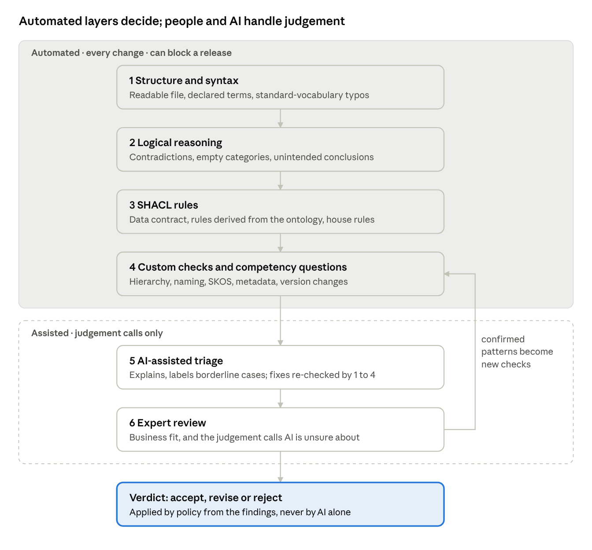

# Ontology Review & Validation: Approaches, Benefits and Trade-offs

Oct 5, 2026 · Marcin Wizgird

> Exported from the shared document at
> https://claude.ai/code/artifact/fb2df66d-a689-4bdc-aef1-1f27928e4cc9. That document is the
> editable original; this file is a snapshot.

## Summary

No single technique can show that an ontology is fit for use. Reliable review stacks several kinds of check, each covering the blind spots of the others. Logic-based **reasoning** proves the model does not contradict itself. **SHACL** rules confirm that real data meets the agreed contract. **Custom quality checks** catch design and housekeeping defects that are logically valid but costly. **Human and AI-assisted review** judge whether the model means what the business means.

The recommended approach runs the automated layers on every change, which is cheap, fast and repeatable. Expert time is reserved for the questions that need judgement. In the agentic validation system, only automated checks can raise a finding or block a release. AI assists with explaining problems, triaging borderline cases and proposing fixes, and every fix is re-checked automatically before anyone sees it.

## What can go wrong

Ontology defects rarely crash anything. They quietly produce wrong answers, missing data and mappings that do not line up, so they are expensive to find late. They fall into six groups:

| Defect group | Example in business terms | Typical consequence |
| --- | --- | --- |
| **Contradictions** | "Locomotive" is placed under "Rail Vehicle" but also declared to be *not* a rail vehicle | The category can never contain anything; every query over it returns nothing |
| **Unintended conclusions** | A property "has driver" is defined for people, so every locomotive using it is silently treated as a person | Search, analytics and AI answers mix up unrelated things |
| **Data that breaks the contract** | A customer record without a mandatory identifier, or a date stored as text | Downstream systems reject or misread the data |
| **Poor structure** | Duplicate categories, "Other" bucket classes, "part of" modelled as "kind of", 40 sub-categories under one parent | Hard to maintain, inconsistent classification, confused users |
| **Missing documentation** | Terms without labels, definitions or licence | Experts cannot review it; legal cannot approve reuse |
| **Unsafe change** | A new version deletes or renames a term other systems depend on | Integrations break without warning |

## Approach 1: Logical reasoning

A reasoner is software that reads the ontology's rules and works out everything they imply. It answers three questions with mathematical certainty. Does the model contradict itself? Can every category actually have members? What does the model conclude that nobody wrote down explicitly?

**What it catches:** contradictions, categories that can never have members, two categories that turn out to mean the same thing, and surprising conclusions (such as the locomotive treated as a person).

**Benefits**

- Findings are certain, not opinions, so they can safely block a release.
- It finds problems no human would spot by reading. One wrong rule can affect hundreds of terms far from where it was written.
- With an explanation step, it shows the exact two or three statements that cause each problem, which turns hours of investigation into minutes.

**Shortcomings**

- It only checks that the model is *consistent*, not that it is *correct*. A model can be perfectly logical and still describe the business wrongly.
- It assumes that anything not stated might still be true (the "open world"). A missing customer identifier is therefore not an error to a reasoner. That is SHACL's job.
- Its power depends on how richly the ontology is written. Simple vocabularies and taxonomies give it little to work with.
- The most expressive reasoning can be slow on very large ontologies. Practical tools trade completeness for speed, and a fast "no problems found" can mean "none found by the fast method".

## Approach 2: SHACL shape validation

SHACL is the W3C standard for writing data rules: "every customer has exactly one identifier", "a contract start date is a date", "every category has an English name and a definition". Validation reports each place where the data or the ontology breaks a rule. It works like a schema check in a database, using a closed-world view in which what is missing counts as missing.

It can be applied three ways. **Publisher rules** are rules a team writes for its own data. **Rules derived from the ontology** turn its own statements ("each account has one owner") into checks on real data. **House rules** are organisation-wide modelling standards written once as data, without code.

**Benefits**

- It catches exactly what reasoning misses: missing, malformed or extra values in real data.
- Rules are readable, standard and portable across tools and vendors, with no lock-in.
- Governance teams can add or change house rules without a software release.
- Results are precise and repeatable, and they map naturally onto data-quality dashboards.

**Shortcomings**

- It checks only what someone thought to write a rule for. Missing rules mean silent gaps, so rule coverage needs to be tracked.
- Rules can be wrong or outdated, for example still pointing to a renamed term, and then they pass or fail misleadingly. The rules need validating too.
- It does not understand meaning. It cannot tell that two categories are duplicates or that a hierarchy is badly designed.
- Rules can contradict the ontology itself, for example requiring one value where the ontology demands two. Such conflicts must be detected explicitly.

## Approach 3: Custom quality checks

Custom checks are purpose-built tests for defects that are logically valid but still costly. The agentic validation system defines 131 of them in 16 families. They are grounded in published catalogues of common pitfalls (OOPS!) and in the W3C SKOS integrity rules. The main groups:

| Check group | What it looks for (examples) |
| --- | --- |
| Hierarchy and inheritance | Circular "kind of" chains; a category disjoint with its own parent; redundant links; orphan categories; hierarchies too deep or too flat; "part of" or "role" modelled as "kind of"; siblings that cannot be told apart |
| Properties and relationships | Missing or multiple domains and ranges; wrong inverses; relationships wrongly marked transitive or symmetric |
| Labels and definitions | Missing labels or definitions; duplicate names; inconsistent naming; definitions that repeat the term; plural category names |
| Thesauri (SKOS) | Several preferred labels per language; conflicting "broader" and "related" links; orphan concepts; duplicate codes |
| Declarations and structure | Typos in standard vocabulary (a silent and very common error); terms used but never declared; changes to terms owned by other teams |
| Metadata and governance | Missing title, owner, licence or version; deprecated terms still in use or without a replacement |
| Change and versioning | Terms deleted without deprecation; renames that break links; conclusions lost since the last version |
| Profile and metrics | How formal the model really is compared with what the publisher claims; size and complexity |

Most of these checks are fully automatic. About 18 need judgement, for example whether "Wheel under Car" is a modelling error or deliberate. For those, the system only flags *candidates*, and AI or an expert decides.

**Benefits**

- They cover the design and housekeeping defects that cause most day-to-day pain and that logic and SHACL cannot see.
- They encode the organisation's own standards, so every team is held to the same bar.
- They are cheap and fast enough to run on every change, like spell-check for ontologies.
- Each check is tested by deliberately planting its defect, so how reliably it catches that defect is measured, not assumed.

**Shortcomings**

- Heuristic checks produce false alarms that need triage, which is why they are capped below "reject".
- Thresholds such as maximum depth or number of children are conventions and need tuning per domain.
- They are only as good as the catalogue. New kinds of defects need new checks, which the system's self-improvement stage is designed to add under supervision.
- Without prioritisation they can flood reviewers, so root-cause grouping and severity levels are essential.

## Other approaches

Five further techniques complete the picture. Each answers a question the three automated layers cannot.

| Approach | How it works | Benefits | Shortcomings |
| --- | --- | --- | --- |
| **Competency-question testing** | The business writes the questions the ontology must answer ("Which suppliers serve region X?"). Each becomes an automated query with an expected result | Ties the model directly to business requirements; works as a regression test on every release | Only as good as the question set; writing and maintaining the queries takes effort |
| **Expert review** | Domain experts walk through terms, definitions and hierarchy, ideally with a structured checklist | The only reliable judge of whether the model reflects how the business actually works | Slow, costly and inconsistent between reviewers; does not scale to thousands of terms or to every change |
| **AI-assisted review** | A language model reads flagged candidates, explains problems in plain words and proposes fixes | Scales expert-like judgement to many items; makes technical findings understandable; drafts repairs | Can be confidently wrong, so it must never decide alone. Fixes need automatic re-checking. Sending content to a provider needs data-governance approval |
| **Version comparison** | Compares the new version with the previous one: what was added, removed, renamed, and what the model now concludes differently | Catches breaking changes before integrations fail; makes release notes factual | Needs a trusted baseline; on its own it says what changed, not whether the change is good |
| **Usage-based validation** | Observes real use: queries that return nothing, terms never used, mapping failures, user feedback | Shows the defects that actually hurt users, and prioritises the backlog | Only after deployment; reflects current usage, which may be biased; needs instrumentation |

Two more are worth knowing. **Metrics and scorecards** track counts and ratios over time, such as the share of terms with definitions. They are good for trends and weak as pass/fail tests. **Alignment checks against reference or upper ontologies** improve interoperability, but only once the organisation has chosen a reference model.

## How the approaches complement each other

Each approach is strong where another is blind. Coverage of the six defect groups:

| Defect group | Reasoning | SHACL | Custom checks | Competency questions | Expert / AI review | Version comparison |
| --- | --- | --- | --- | --- | --- | --- |
| Contradictions | Strong | — | Partial (explains cause) | Partial | Weak | — |
| Unintended conclusions | Strong | — | Partial | Partial | Partial | Strong (new conclusions) |
| Data breaking the contract | — | Strong | Partial | Partial | Weak | — |
| Poor structure | Weak | Partial (house rules) | Strong | Weak | Strong | — |
| Missing documentation | — | Strong (house rules) | Strong | — | Partial | — |
| Unsafe change | Partial | — | Partial | Strong (regression) | Weak | Strong |
| *Fit with the business* | — | — | — | Strong | Strong | — |

| Approach | Speed and cost per run | Certainty of findings | Needs expert input |
| --- | --- | --- | --- |
| Reasoning | Seconds to minutes; low | Proven | No |
| SHACL | Seconds; low | Exact against the rules | To write the rules |
| Custom checks | Seconds; low | Exact, or candidates for judgement | To set policy and thresholds |
| Competency questions | Seconds; low once written | Exact against expected answers | To write the questions |
| AI-assisted review | Seconds per item; moderate API cost | Probable; must be verified | To validate its judgements |
| Expert review | Days; high | Authoritative but variable | Yes |
| Version comparison | Seconds to minutes; low | Exact | To judge the changes |

Three pairings matter most:

- **Reasoning and SHACL** are two halves of one picture. Reasoning asks "could this be true?" (open world). SHACL asks "is it actually here?" (closed world). Running both, with SHACL rules derived from the ontology itself, shows the publisher both views of the same statement.
- **Custom checks and AI review.** Checks find candidates cheaply and completely. AI explains and triages them so that experts see a short, ranked list instead of hundreds of raw flags.
- **Automation and experts.** Automated layers remove the mechanical work, so expert time goes to the questions only people can answer: is this the right model of our business?

## Recommended layered review

Run the cheap, certain checks first and on every change. Bring in AI and experts only for what needs judgement.

Layers 1 to 4 run automatically in seconds to minutes and can block a release on their own. Layer 5 reduces hundreds of flags to a short, explained list. Layer 6 decides what only people can. When experts keep confirming the same kind of defect, it is turned into a new automated check after review, so the automated layers grow over time.

The agentic validation system follows this design. Its findings come only from the 131 catalogued checks. AI cannot reject a submission on its own judgement. Every proposed fix is re-validated before it is shown, and every verdict records which rules, policy and versions produced it, for audit.

## Decisions for business owners

- [ ] **Policy strictness.** Which severities block a release and which only request revision. A lenient mode is available while teams adopt the tool.
- [ ] **House rules.** The organisation-wide modelling standards to encode, for example mandatory English labels, definitions and licence.
- [ ] **Reference model.** Whether to align ontologies to a shared upper model (such as BFO or gist), and which one.
- [ ] **AI use.** Whether AI-assisted review is enabled, which providers are approved, and whether content is redacted before it is sent.
- [ ] **Expert capacity.** Who reviews flagged judgement calls, and the target turnaround time.
- [ ] **Competency questions.** Which business owners supply and maintain the questions each ontology must answer.

## Glossary

| Term | Meaning |
| --- | --- |
| Ontology | A formal, shared model of a domain's concepts, their relationships and rules, readable by both people and machines |
| Reasoner | Software that works out everything an ontology's rules imply, and detects contradictions |
| SHACL | W3C standard language for writing data rules ("shapes") and checking data against them |
| SKOS | W3C standard for thesauri and taxonomies: preferred labels, broader and narrower terms |
| Open world / closed world | Open: what is not stated may still be true (reasoning). Closed: what is not stated is missing (SHACL) |
| Competency question | A business question the ontology must be able to answer, written as a test |
| Finding | One detected issue, with its check, severity, location and evidence |
| Root cause | The few statements that produce a group of related findings |
| Verdict | The policy outcome: accept, revise or reject |
